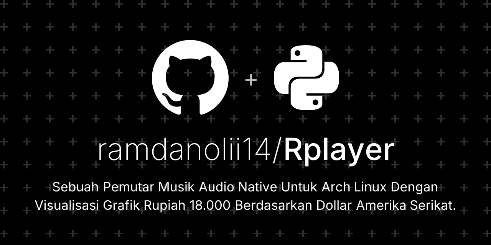
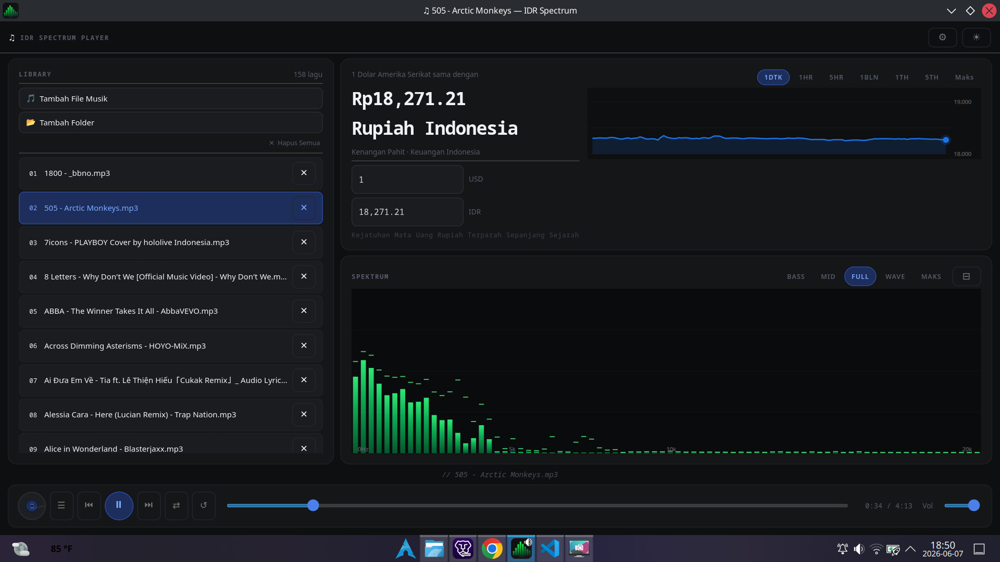
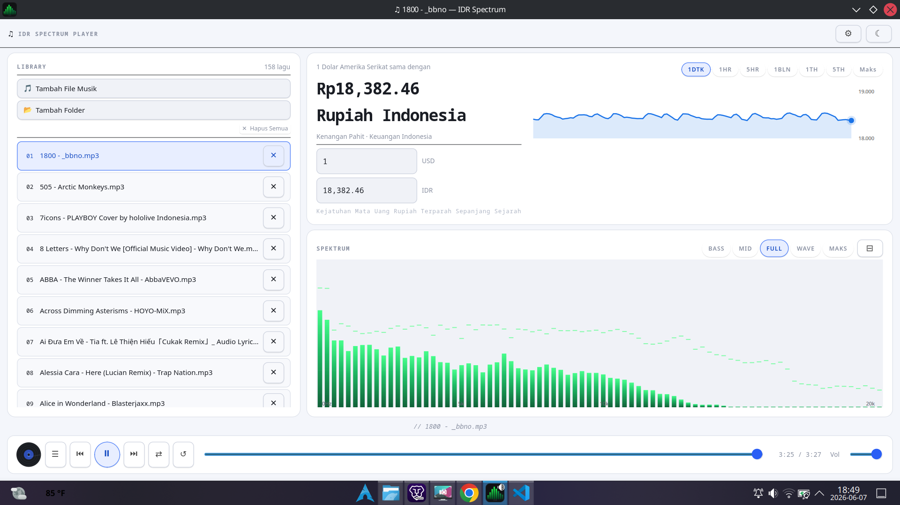
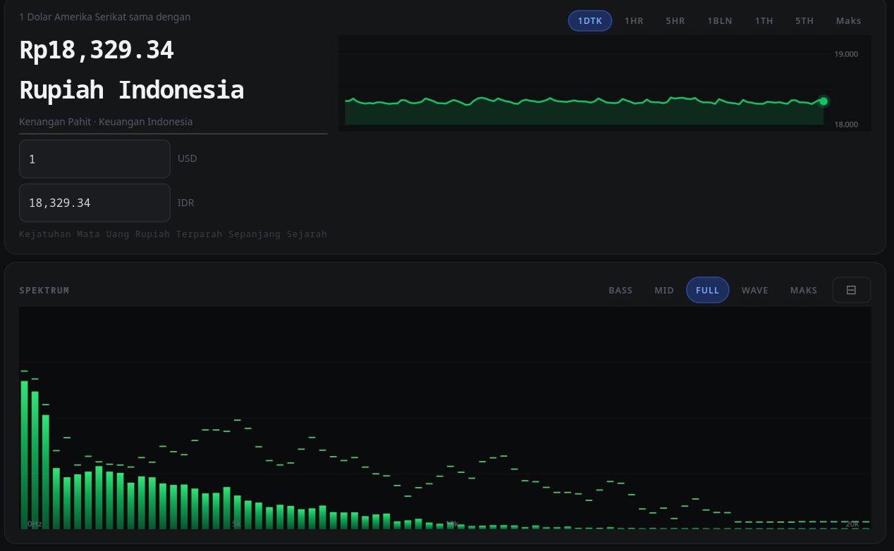

# IDR Spectrum Player

<p align="center">
  
</p>

<p align="center">
  
  
  
  
  
  
</p>

Pemutar musik audio native untuk Arch Linux yang menampilkan visualisasi spektrum frekuensi secara real-time, dilengkapi grafik kurs Rupiah (IDR/USD) bergaya Google Finance yang bergerak mengikuti irama musik. Dibangun di atas GTK 4 dan GStreamer, sepenuhnya native tanpa Electron atau runtime berat.

---

## Daftar Isi

- [Tentang Proyek](#tentang-proyek)
- [Fitur](#fitur)
- [Screenshot](#screenshot)
- [Persyaratan Sistem](#persyaratan-sistem)
- [Instalasi](#instalasi)
  - [AUR (Direkomendasikan)](#aur-direkomendasikan)
  - [AppImage](#appimage)
  - [Dari Sumber](#dari-sumber)
- [Menjalankan Secara Manual](#menjalankan-secara-manual)
- [Membangun AppImage](#membangun-appimage)
- [Dependensi](#dependensi)
- [Struktur Berkas](#struktur-berkas)
- [Konfigurasi](#konfigurasi)
- [Format Audio yang Didukung](#format-audio-yang-didukung)
- [Kontribusi](#kontribusi)
- [Lisensi](#lisensi)
- [Star History](#star-history)

---

## Tentang Proyek

IDR Spectrum Player lahir dari gagasan sederhana, menggabungkan pemutar musik fungsional dengan representasi visual kurs Rupiah terhadap Dollar Amerika Serikat pada angka Rp 18.000. Grafik IDR pada antarmuka bergerak secara sinkron dengan intensitas audio yang sedang diputar, menciptakan visualisasi yang unik dan informatif sekaligus.

Proyek ini sepenuhnya ditulis dalam Python dengan antarmuka GTK 4, memanfaatkan pipeline GStreamer untuk pemrosesan audio dan analisis spektrum frekuensi. Tidak ada ketergantungan pada framework JavaScript, Electron, atau runtime eksternal yang berat.

---

## Fitur

**Visualisasi Spektrum Audio**
- 80 band frekuensi dengan smoothing adaptif
- Lima mode tampilan: FULL, BASS, MID, WAVE, dan MAKS
- Delapan preset warna: Hijau, Biru, Ungu, Oranye, Merah, Cyan, Pink, Putih
- Indikator peak dengan animasi decay

**Grafik Kurs IDR**
- Grafik bergaya Google Finance dengan riwayat 120 titik data
- Nilai IDR bergerak antara Rp 18.000 hingga Rp 19.999 mengikuti intensitas audio
- Sembilan preset warna grafik yang dapat dipilih
- Label sumbu Y otomatis

**Manajemen Pustaka Musik**
- Tambah file individual atau seluruh folder secara rekursif
- Daftar putar persisten yang tersimpan antar sesi
- Ekstraksi cover art dari metadata ID3 (MP3), FLAC, dan M4A

**Kontrol Pemutaran**
- Shuffle acak dengan algoritma Fisher-Yates
- Tiga mode repeat: none, repeat all, repeat one
- Kontrol volume dengan slider
- Progress bar dengan kemampuan scrubbing
- Keyboard shortcut intuitif

**Antarmuka**
- Tema gelap dan terang yang dapat diubah sewaktu-waktu
- Konfigurasi persisten disimpan di `~/.config/idr-spectrum/config.json`
- Auto-save konfigurasi setiap 30 detik
- Ikon aplikasi terintegrasi dengan desktop environment

---

## Screenshot

<p align="center">
  
  <br/>
  <em>Tampilan tema gelap dengan visualisasi spektrum aktif</em>
</p>

<p align="center">
  
  <br/>
  <em>Tampilan tema terang</em>
</p>

<p align="center">
  
  <br/>
  <em>Grafik kurs IDR bergaya Google Finance yang bergerak mengikuti audio</em>
</p>

> Catatan: Belum Ada

---

## Persyaratan Sistem

- Arch Linux atau distribusi berbasis Arch (Manjaro, EndeavourOS, dll.)
- Python 3.11 atau lebih baru
- GTK 4.0
- GStreamer 1.0 dengan plugin-plugin berikut (lihat [Dependensi](https://aur.archlinux.org/packages/rplayer-bin))

---

## Instalasi

### AUR (Direkomendasikan)

Instalasi termudah menggunakan AUR helper `yay`:

```bash
yay -S rplayer-bin
```

Perintah ini akan mengunduh paket biner yang sudah dikompilasi, memasang semua dependensi secara otomatis, dan mendaftarkan aplikasi ke menu launcher desktop.

Setelah instalasi selesai, jalankan dari launcher atau melalui terminal:

```bash
idr-spectrum-player
```

---

### AppImage

Unduh AppImage dari halaman [Releases](https://github.com/ramdanolii14/Rplayer/releases/latest):

```bash
# Unduh AppImage
wget https://github.com/ramdanolii14/Rplayer/releases/download/v1.0/IDR-Spectrum-Player-x86_64.AppImage

# Beri izin eksekusi
chmod +x IDR-Spectrum-Player-x86_64.AppImage

# Jalankan
./IDR-Spectrum-Player-x86_64.AppImage
```

AppImage bersifat portable dan tidak memerlukan instalasi. Dependensi sistem seperti GTK 4 dan GStreamer tetap harus tersedia di sistem host.

---

### Dari Sumber

```bash
# Clone repositori
git clone https://github.com/ramdanolii14/Rplayer.git
cd Rplayer

# Pasang dependensi (Arch Linux)
sudo pacman -S python gtk4 python-gobject gstreamer gst-plugins-base \
  gst-plugins-good gst-plugins-bad gst-plugins-ugly python-cairo

# Jalankan
python3 idr_spectrum_player.py
```

---

## Menjalankan Secara Manual

```bash
python3 idr_spectrum_player.py
```

Atau jika sudah dipasang melalui AUR:

```bash
idr-spectrum-player
```

---

## Membangun AppImage

Skrip `build-appimage.sh` disertakan untuk membangun AppImage dari sumber. Jalankan dari direktori root repositori:

```bash
# Pastikan appimagetool tersedia
yay -S appimagetool-bin

# Jalankan builder
chmod +x build-appimage.sh
./build-appimage.sh
```

Hasil build akan menjadi file `IDR-Spectrum-Player-x86_64.AppImage` di direktori yang sama. Skrip build juga memerlukan `librsvg` untuk konversi ikon SVG ke PNG:

```bash
sudo pacman -S librsvg
```

---

## Dependensi

### Dependensi Runtime (wajib)

| Paket | Deskripsi |
|---|---|
| `python >= 3.11` | Interpreter Python |
| `gtk4` | Toolkit antarmuka grafis GTK versi 4 |
| `python-gobject` | Binding Python untuk GLib/GObject/GTK (PyGObject) |
| `gstreamer` | Framework multimedia GStreamer 1.0 |
| `gst-plugins-base` | Plugin GStreamer dasar (playbin, decodebin, audioconvert, audioresample, spectrum) |
| `gst-plugins-good` | Plugin GStreamer berkualitas stabil (FLAC, OGG/Vorbis, WAV, equalizer) |
| `gst-plugins-bad` | Plugin GStreamer tambahan (AAC, Opus, WMA, M4A) |
| `gst-plugins-ugly` | Plugin GStreamer dengan isu lisensi (MP3 via libmad/libmpeg123) |
| `python-cairo` | Binding Python untuk Cairo 2D graphics (digunakan untuk gradient spektrum) |

### Dependensi Build (opsional, hanya untuk membangun AppImage)

| Paket | Deskripsi |
|---|---|
| `appimagetool-bin` | Tool untuk membuat file AppImage (tersedia di AUR) |
| `librsvg` | Konversi ikon SVG ke PNG untuk AppImage |

### Instalasi Semua Dependensi Sekaligus

```bash
sudo pacman -S python gtk4 python-gobject gstreamer \
  gst-plugins-base gst-plugins-good gst-plugins-bad \
  gst-plugins-ugly python-cairo librsvg
```

---

## Struktur Berkas

```
Rplayer/
├── idr_spectrum_player.py          # Source code utama (~1964 baris)
├── id.ramdanolii.idrspectrum.desktop  # File desktop entry
├── id.ramdanolii.idrspectrum.svg      # Ikon aplikasi format SVG
├── build-appimage.sh               # Skrip builder AppImage
├── run.sh                          # Skrip jalankan cepat
├── IDR-Spectrum-Player-x86_64.AppImage  # Binary AppImage (lihat Releases)
├── IDRSpectrum.AppDir/             # Direktori AppDir untuk build
│   ├── AppRun
│   ├── usr/bin/
│   ├── usr/share/applications/
│   ├── usr/share/icons/
│   └── usr/share/metainfo/
├── assets/                         # Screenshot dan aset visual
├── LICENSE                         # Lisensi GPL-3.0
└── README.md
```

---

## Konfigurasi

Konfigurasi aplikasi disimpan secara otomatis di:

```
~/.config/idr-spectrum/config.json
```

Contoh isi konfigurasi:

```json
{
  "is_dark": true,
  "spec_color": "Hijau",
  "chart_color": "Biru",
  "spec_visible": true,
  "shuffle": false,
  "repeat_mode": "none",
  "volume": 1.0,
  "library": [
    "/home/user/Music/lagu1.mp3",
    "/home/user/Music/lagu2.flac"
  ],
  "current_idx": 0
}
```

Konfigurasi disimpan otomatis setiap 30 detik dan saat menutup aplikasi. Untuk mereset ke pengaturan default, hapus file tersebut:

```bash
rm ~/.config/idr-spectrum/config.json
```

---

## Format Audio yang Didukung

| Format | Ekstensi | Plugin yang Diperlukan |
|---|---|---|
| MP3 | `.mp3` | `gst-plugins-ugly` |
| FLAC | `.flac` | `gst-plugins-good` |
| OGG Vorbis | `.ogg` | `gst-plugins-good` |
| WAV | `.wav` | `gst-plugins-good` |
| M4A / AAC | `.m4a`, `.aac` | `gst-plugins-bad` |
| Opus | `.opus` | `gst-plugins-bad` |
| WMA | `.wma` | `gst-plugins-bad` |

---

## Kontribusi

Kontribusi dalam bentuk apapun sangat diterima. Silakan buka issue untuk melaporkan bug atau mengusulkan fitur baru, dan buat pull request untuk perubahan kode.

1. Fork repositori ini
2. Buat branch fitur: `git checkout -b fitur/nama-fitur`
3. Commit perubahan: `git commit -m 'Tambah fitur: nama-fitur'`
4. Push ke branch: `git push origin fitur/nama-fitur`
5. Buka Pull Request

---

## Lisensi

Proyek ini dilisensikan di bawah [GNU General Public License v3.0](LICENSE).

---

## Star History

[](https://www.star-history.com/?repos=ramdanolii14%2FRplayer&type=date&logscale=&legend=top-left)

---

<p align="center">
  Dibuat untuk pengguna Arch Linux di Indonesia.
</p>
